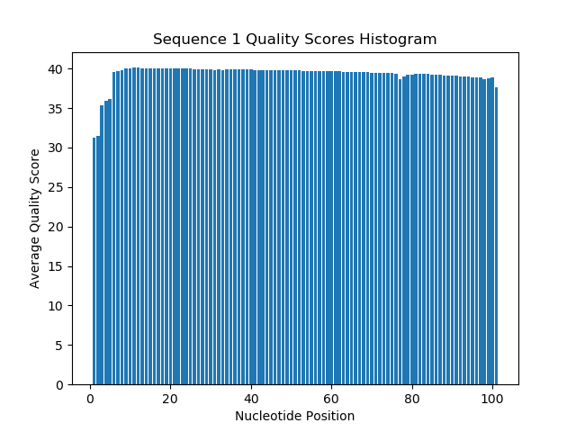
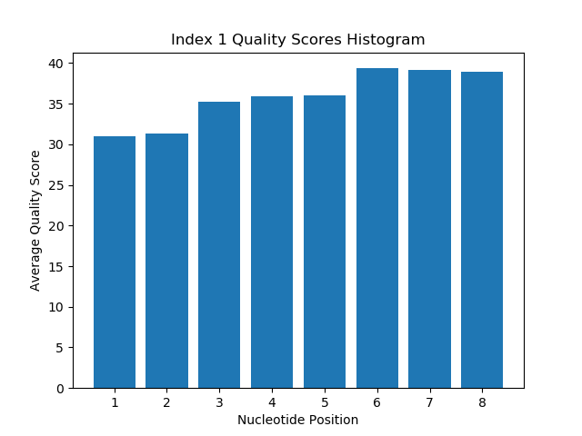
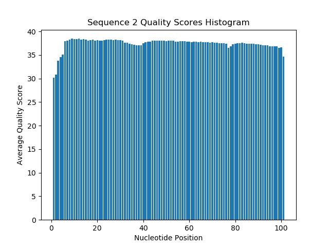
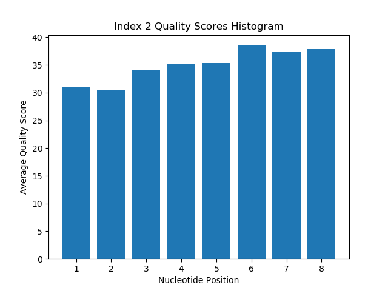

Paula Berry
<br>Demultiplexing assignment


**Part 1: Quality Score Distribution per Nucleotide**

1.
<br>a) Table of files

| filename | contents |
|------------|--------------|
| 1294_S1_L008_R1_001.fastq.gz | read 1 |
| 1294_S1_L008_R2_002.fastq.gz | index 1 |
| 1294_S1_L008_R2_003.fastq.gz | index 2 |
| 1294_S1_L008_R4_001.fastq.gz | read 2 |

b) Histograms:

Data is contained in demultiplex.out. The average quality score for each file is used as the cut off.

Scripts used to generate data:<br>
demultiplex.sh - script with slurm and bash commands to initialize correct python environment and call the python script.<br>
demultiplex.py - python script that performed the statistical analysis on the read quality and generated the histograms.

Sequence 1 average quality score cut off: 39.315685332524005




Index 1 average quality score cut off: 35.86209954646942




Sequence 2 average quality score cut off: 37.427600426257854




Index 2 average quality score cut off: 34.976062685394815




c) 7304664 indexes were sequenced with an "N" base call. I used n_index.sh to wrap the following command in slurm script.

```$ /usr/bin/time -v zcat /projects/bgmp/shared/2017_sequencing/1294_S1_L008_R2_001.fastq.gz /projects/bgmp/shared/2017_sequencing/1294_S1_L008_R3_001.fastq.gz | awk 'NR % 4 == 2' | grep '[N]\+' | wc -l > n_index_count.txt```

2. Algorithm written in pseudocode is available on demultiplex_algorithm.md.
